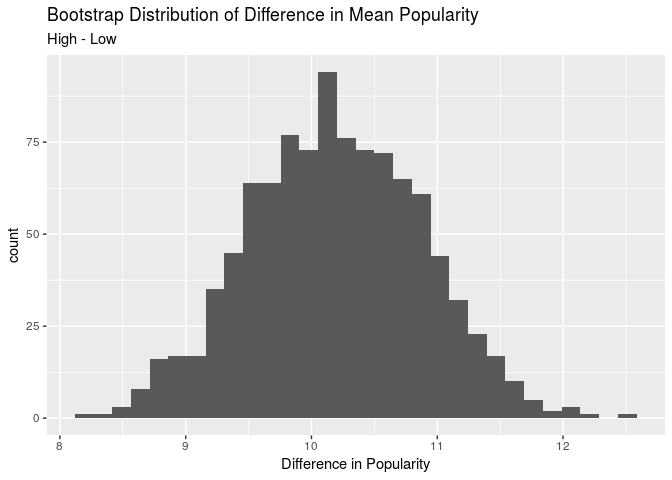

Bootstrap
================

    ## `stat_bin()` using `bins = 30`. Pick better value with `binwidth`.

<!-- -->

    ## # A tibble: 1 x 2
    ##   lower_bound upper_bound
    ##         <dbl>       <dbl>
    ## 1        3.57        6.58

We are 95% certain that the difference in means between the popularity
score of the rap and pop genre is between 5.83 and 6.26.

    ## # A tibble: 2 x 2
    ##   mode  average
    ##   <chr>   <dbl>
    ## 1 Major    43.9
    ## 2 Minor    45.5

    ## `stat_bin()` using `bins = 30`. Pick better value with `binwidth`.

<!-- -->

    ## # A tibble: 1 x 2
    ##   lower_bound upper_bound
    ##         <dbl>       <dbl>
    ## 1       0.639        2.55

We are 95% certain that the difference in means between the popularity
score of the rap and pop genre is between 1.77 and
    2.08.

    ## `stat_bin()` using `bins = 30`. Pick better value with `binwidth`.

<!-- -->

    ## # A tibble: 1 x 4
    ##     max    min    q1    q3
    ##   <dbl>  <dbl> <dbl> <dbl>
    ## 1 0.972 0.0595 0.442 0.695

    ## # A tibble: 2 x 2
    ##   danceHL average
    ##   <chr>     <dbl>
    ## 1 High       46.9
    ## 2 Low        36.9

    ## `stat_bin()` using `bins = 30`. Pick better value with `binwidth`.

<!-- -->

    ## # A tibble: 1 x 2
    ##   lower_bound upper_bound
    ##         <dbl>       <dbl>
    ## 1        8.91        11.1

We are 95% certain that the difference between the songs with higher
(\>= 1st quartile) danceability and the lower (\<= 3rd quartile)
danceability is between 10.30 and
    10.61.

    ## `stat_bin()` using `bins = 30`. Pick better value with `binwidth`.

<!-- -->

    ## # A tibble: 1 x 4
    ##     max     min    q1    q3
    ##   <dbl>   <dbl> <dbl> <dbl>
    ## 1 0.997 0.00181 0.411 0.799

    ## # A tibble: 2 x 2
    ##   energyHL average
    ##   <chr>      <dbl>
    ## 1 High        45.6
    ## 2 Low         35.5

    ## `stat_bin()` using `bins = 30`. Pick better value with `binwidth`.

<!-- -->

    ## # A tibble: 1 x 2
    ##   lower_bound upper_bound
    ##         <dbl>       <dbl>
    ## 1        8.83        11.5

We are 95% certain that the difference between the songs with higher
(\>= 1st quartile) energy and the lower (\<= 3rd quartile) energy is
between 10.91 and 11.32.
