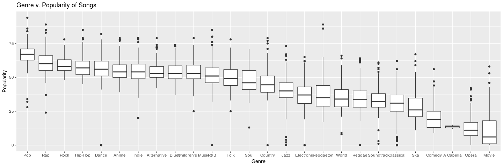
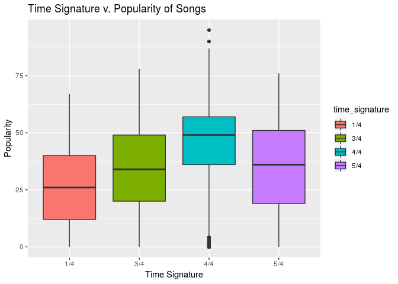
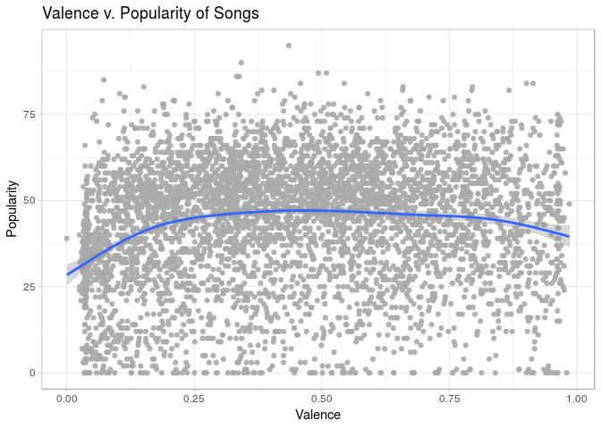

Project Proposal: What Makes a Song Popular on Spotify?
================
CCBK
3/21/18

    ## Parsed with column specification:
    ## cols(
    ##   genre = col_character(),
    ##   artist_name = col_character(),
    ##   track_name = col_character(),
    ##   track_id = col_character(),
    ##   popularity = col_double(),
    ##   acousticness = col_double(),
    ##   danceability = col_double(),
    ##   duration_ms = col_double(),
    ##   energy = col_double(),
    ##   instrumentalness = col_double(),
    ##   key = col_character(),
    ##   liveness = col_double(),
    ##   loudness = col_double(),
    ##   mode = col_character(),
    ##   speechiness = col_double(),
    ##   tempo = col_double(),
    ##   time_signature = col_character(),
    ##   valence = col_double()
    ## )

### Introduction

### Visualization

Relationship Between Different Variables and Song
    Popularity

<!-- -->

    ## `geom_smooth()` using method = 'gam' and formula 'y ~ s(x, bs = "cs")'

<!-- -->

    ## `geom_smooth()` using method = 'gam' and formula 'y ~ s(x, bs = "cs")'

<!-- -->

    ## `geom_smooth()` using method = 'gam' and formula 'y ~ s(x, bs = "cs")'

<!-- -->

    ## `geom_smooth()` using method = 'gam' and formula 'y ~ s(x, bs = "cs")'

<!-- -->

    ## `geom_smooth()` using method = 'gam' and formula 'y ~ s(x, bs = "cs")'

<!-- -->

<!-- -->

    ## `geom_smooth()` using method = 'gam' and formula 'y ~ s(x, bs = "cs")'

<!-- -->

    ## `geom_smooth()` using method = 'gam' and formula 'y ~ s(x, bs = "cs")'

<!-- -->

<!-- -->

    ## `geom_smooth()` using method = 'gam' and formula 'y ~ s(x, bs = "cs")'

<!-- -->

    ## `geom_smooth()` using method = 'gam' and formula 'y ~ s(x, bs = "cs")'

<!-- -->

<!-- -->

    ## `geom_smooth()` using method = 'gam' and formula 'y ~ s(x, bs = "cs")'

<!-- -->

### Data Wrangling

### Linear Regression

    ## 
    ## Call:
    ## lm(formula = popularity ~ acousticness + danceability + energy + 
    ##     instrumentalness + liveness + loudness + speechiness + tempo + 
    ##     valence + loudness * liveness, data = songs)
    ## 
    ## Coefficients:
    ##       (Intercept)       acousticness       danceability  
    ##          57.27147          -11.83038           16.70482  
    ##            energy   instrumentalness           liveness  
    ##          -9.93363           -4.25321           -2.46628  
    ##          loudness        speechiness              tempo  
    ##           0.81221           -8.40820            0.02311  
    ##           valence  liveness:loudness  
    ##          -9.36277            0.80716

    ## [1] 0.2986424

    ## [1] 0.2972366

    ## Start:  AIC=26810.05
    ## popularity ~ acousticness + danceability + energy + instrumentalness + 
    ##     liveness + loudness + speechiness + tempo + valence + loudness * 
    ##     liveness
    ## 
    ##                     Df Sum of Sq     RSS   AIC
    ## <none>                           1061086 26810
    ## - tempo              1    2250.5 1063336 26819
    ## - liveness:loudness  1    3172.3 1064258 26823
    ## - instrumentalness   1    5061.5 1066147 26832
    ## - speechiness        1    6420.0 1067506 26838
    ## - energy             1    6518.9 1067605 26839
    ## - valence            1   16694.5 1077780 26886
    ## - danceability       1   24551.0 1085637 26922
    ## - acousticness       1   30380.1 1091466 26949

    ## 
    ## Call:
    ## lm(formula = popularity ~ acousticness + danceability + energy + 
    ##     instrumentalness + liveness + loudness + speechiness + tempo + 
    ##     valence + loudness * liveness, data = songs)
    ## 
    ## Coefficients:
    ##       (Intercept)       acousticness       danceability  
    ##          57.27147          -11.83038           16.70482  
    ##            energy   instrumentalness           liveness  
    ##          -9.93363           -4.25321           -2.46628  
    ##          loudness        speechiness              tempo  
    ##           0.81221           -8.40820            0.02311  
    ##           valence  liveness:loudness  
    ##          -9.36277            0.80716

    ## [1] 0.2986424

    ## [1] 0.2972366

score\_hat = 56.20 + -11.30 \* acousticness + 17.19 \* danceability -
5.933 \* energy - 4.11 \* instrumentalness + -6.40 \* liveness + 0.60 \*
loudness + -10.36 \* speechiness + -8.25 \* valence + 0.62 \*
liveness:loudness

When all variables have a value of 0, then it is expected that a song’s
populariy is 56.20 One example of how a variable influences the
popularity is with acousticness. If a song’s acoustic score increases by
1 then popularity will on average decrease by 11.30 points, all else
held constant. There is also an apparent interaction between
danceability and energy. When the interaction increases by one on
average the popularity decreases by 12.96 points, all else held
constant.

The adjusted R squared value for this model is 0.289, which means that
roughly 28.9% of the variability in a song’s popularity can be explained
by the different variables in the multiple regression model. This
indicates that there is a weak to moderate positive overall realtionship
between a song’s popularity and the different variables related to a
song.

    ## 
    ## Call:
    ## lm(formula = popularity ~ mode, data = songs)
    ## 
    ## Coefficients:
    ## (Intercept)    modeMinor  
    ##      43.260        2.033

    ## [1] 0.003149919

score\_hat = 43.77 + 2.007 \* mode\_minor

Minor equation: score\_hat = 43.77 + 2.007 \* 1 = 45.77

Major equestion: score\_hat = 43.77 + 2.007 \* 0 = 43.77

Songs that are in the major mode tent to have higher popularity scores
than songs in a minor key. All else held constant, theere is an expected
popularity score increase of 2.007 if the song is in the minor key
compared to the major key.

    ## 
    ## Call:
    ## lm(formula = popularity ~ energy, data = songs)
    ## 
    ## Coefficients:
    ## (Intercept)       energy  
    ##       32.79        19.28

    ## [1] 0.08138488

    ## 
    ## Call:
    ## lm(formula = popularity ~ danceability, data = songs)
    ## 
    ## Coefficients:
    ##  (Intercept)  danceability  
    ##        27.84         29.09

    ## [1] 0.09281284

    ## 
    ## Call:
    ## lm(formula = popularity ~ liveness, data = songs)
    ## 
    ## Coefficients:
    ## (Intercept)     liveness  
    ##       47.70       -17.32

    ## [1] 0.03832614

    ## 
    ## Call:
    ## lm(formula = popularity ~ liveness, data = songs)
    ## 
    ## Coefficients:
    ## (Intercept)     liveness  
    ##       47.70       -17.32

    ## [1] 0.03832614

### Bootstrapping

### Conclusion

Your project goes here\! Before you submit, make sure your chunks are
turned off with `echo = FALSE`.

You can add sections as you see fit. Make sure you have a section called
Introduction at the beginning and a section called Conclusion at the
end. The rest is up to you\!
