Project Proposal: What Makes a Song Popular on Spotify?
================
CCBK
3/21/18

    ## Parsed with column specification:
    ## cols(
    ##   genre = col_character(),
    ##   artist_name = col_character(),
    ##   track_name = col_character(),
    ##   track_id = col_character(),
    ##   popularity = col_double(),
    ##   acousticness = col_double(),
    ##   danceability = col_double(),
    ##   duration_ms = col_double(),
    ##   energy = col_double(),
    ##   instrumentalness = col_double(),
    ##   key = col_character(),
    ##   liveness = col_double(),
    ##   loudness = col_double(),
    ##   mode = col_character(),
    ##   speechiness = col_double(),
    ##   tempo = col_double(),
    ##   time_signature = col_character(),
    ##   valence = col_double()
    ## )

### Introduction

The goal of our project is to determine the qualities of a song that
influence popularity on Spotify. The dataset was retrieved online from
kaggle.com. The data is derived from the Spotify Web API, which uses
internal Spotify metrics to determine the parameters of the dataset. For
subjective variables such as danceability and instrumentalness, the
Spotify Web API utilizes Echo Nest algorithms. The dataset curator
retrieved data for 228159 songs at random and aggregated this
information into the dataset. Because the data set was so large and
difficult to analyze in R-studio, a random sample of 5000 data points
was taken and a new csv file was made.

This project will analyze the variables of a song that correlate with a
higher song popularity. To find this, we will assign song popularity as
our dependent response variable and the other variables such as
danceability, energy, and key as our predictor variables. Using
backwards selection using multiple predictors models, we can determine
which variables are the best predictors of a song’s popularity score.
Higher R^2 value for single predictors model or a higher adjusted R^2
value for multiple predictors can help us determine this. Visualizations
will be used to show general trends in popularity through various the
qualitative and quantitative variables. Bootstraps and permutations will
look at whether significant differences exist between certain variables
as well as confidence intervals. These different statistical strategies
all contribute to the research question of what qualities of a song
contribute to its
popularity.

### Visualization

#### Exploratory Analysis of Relationships Between Different Variables and Song Popularity

In this section, we conducted an exploratory analysis of the
relationships between different variables and song popularity, in order
to determine which characteristics of songs are good predictors of the
popularity of songs.

Below, we used the groupby() and summarise() functions to find the
median popularity of songs, based on their genres. Then, we arranged
this data in decending order and found that the Pop genre has the
greatest median song popularity and the movie genre has the lowest
median song popularity.

    ## # A tibble: 26 x 2
    ##    genre            medianpop
    ##    <chr>                <dbl>
    ##  1 Pop                     66
    ##  2 Rap                     60
    ##  3 Rock                    58
    ##  4 Dance                   57
    ##  5 Hip-Hop                 57
    ##  6 Alternative             54
    ##  7 Anime                   54
    ##  8 Blues                   54
    ##  9 Children’s Music        54
    ## 10 Indie                   54
    ## # … with 16 more rows

This boxplot visualizes the distribution of the genre with the highest
median popularity (Pop) and the genre with the lowest median popularity
(Movie). The Pop plot is relatively normal shaped, as the median is
located in the center of the data. There appears to be six outliers in
the data set, three above the median song popularity and three below the
median song popularity. The movie plot is not normally shaped, as the
majority of the data lies above the median in the upper quartile, making
the plot slightly-right skewed. There appears to be three outliers in
the data set, all of which lie above the median song
popularity.

<!-- -->

This scatterplot visualizes the relationship between a confidence
measure of whether songs are acoustic (acousticness) and the popularity
of Spotify songs. There appears to be a generally indirect trend in the
data. According to the data, as acousticness increases, song popularity
decreases. The relationship between acousticness and song popularity is
non-linear.

    ## `geom_smooth()` using method = 'gam' and formula 'y ~ s(x, bs = "cs")'

<!-- -->

This scatterplot visualizes the relationship between the energy and
popularity of Spotify songs. There appears to be a generally direct
trend in the data. According to the visualization, as song energy
increases, song popularity increases as well. The relationship between
energy and song popularity is
    non-linear.

    ## `geom_smooth()` using method = 'gam' and formula 'y ~ s(x, bs = "cs")'

<!-- -->

This scatterplot visualizes the relationship between the how suitable a
song is for dancing (danceability) and the popularity of Spotify songs.
There appears to be a generally direct trend in the data. According to
the visualization as danceability increases, song popularity increases
as well. The relationship between danceability and song popularity is
non-linear.

    ## `geom_smooth()` using method = 'gam' and formula 'y ~ s(x, bs = "cs")'

<!-- -->

Before creating the plot, we used the mutate() function to create a new
variable that measures the duration of songs in seconds. We also used
the filter() function to remove extreme outliers from the data and make
it easier to see observations in the heavily populated regions in the
visualization.

This scatterplot visualizes the relationship between the duration and
popularity of songs on Spotify. According to the data, songs with
durations of about 200 seconds (3.33 minutes) appear to have the highest
average popularity. The relationship between song duration and
popularity is non-linear. The majority of songs are under 600 seconds
(10 minutes) long. Since the majority of Spotify songs are similar in
length, duration does not appear to be a strong predictor of song
popularity.

    ## `geom_smooth()` using method = 'gam' and formula 'y ~ s(x, bs = "cs")'

<!-- -->

This scatterplot visualizes the relationship between whether songs are
predicted to be majority instrumental (instrumentalness) and the
popularity of songs. There appears to be a generally indirect trend in
the data. According to the visualization, as the intrumentalness of a
song increases, the popularity of the song decreases. The relationship
between instrumentalness and popularity is
    non-linear.

    ## `geom_smooth()` using method = 'gam' and formula 'y ~ s(x, bs = "cs")'

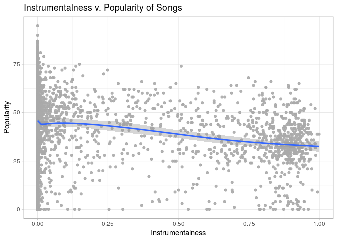<!-- -->

This boxplot visualizes the distribution of song popularity based on the
keys of songs. According to the data, the key with the highest median
song popularity is F\#. Since there is little variability between the
median popularities of songs, based on the track’s key, key does not
appear to be a strong predictor of song popularity.

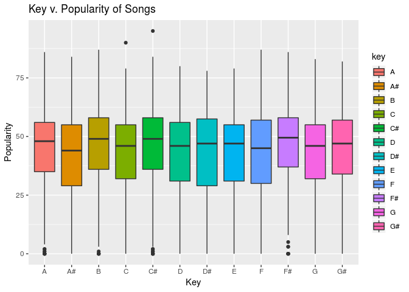<!-- -->

This scatterplot visualizes the relationship between the likeliness that
songs were preformed live (liveness) and the popularity of songs. There
appears to be a generally indirect trend in the data. According to the
visualization, as the liveness of a song increases, the song popularity
decreases. The relationship between popularity and liveness is
non-linear.

    ## `geom_smooth()` using method = 'gam' and formula 'y ~ s(x, bs = "cs")'

<!-- -->

Before creating this plot, we filtered the loudness variable to remove
extreme outliers from the data and make heavily populated regions of the
visualization easier to see. This scatterplot visualizes the
relationship between the loudness and popularity of songs. There appears
to be a a generally direct trend in the data. According to the
visualization, as loudness increases,song popularity increases as well.
The relationship between popularity and loudness is
    non-linear.

    ## `geom_smooth()` using method = 'gam' and formula 'y ~ s(x, bs = "cs")'

<!-- -->

This box plot visualizes the distribution of song popularity, based on
the modality (mode) of the track. According to the visualization, the
median popularity of songs with minor modalities is slightly higher than
the median popularity of sons with major modalities. The minor plot is
not normally shaped, as the majority of the data lies below the median,
making the plot slightly left-skewed. There appears to be two outliers
in the minor plot, both of which fall below the median song popularity
of songs with minor modalities. The major plot is also not normally
shaped, as the majority of the data lies below the median, making it
slightly left-skewed. There appears to be one outlier in the major data,
which falls above the median popularity of songs with major modalities.

<!-- -->

This scatterplot visualizes the relationship between how exclusively
speech-like songs are (speechiness) and the popularity of songs. There
appears to be a generally indirect trend in the data. According to the
visualization, as speechiness increases, song popularity decreases. The
relationship between popularity and speechiess is
    non-linear.

    ## `geom_smooth()` using method = 'gam' and formula 'y ~ s(x, bs = "cs")'

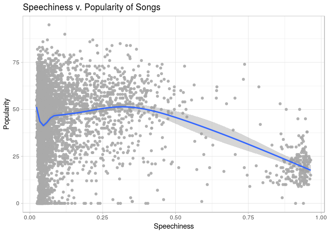<!-- -->

This scatterplot visualizes the relationship between the tempo and
popularity of songs. There appears to be a generally direct trend in the
data. According to the data, as tempo increases, popularity increases as
well. The relationship between popularity and liveness is
    non-linear.

    ## `geom_smooth()` using method = 'gam' and formula 'y ~ s(x, bs = "cs")'

<!-- -->

This boxplot visualizes the distribution of song popularity, based on
the time-signature of each track. According to the visualization, the
median song popularity is greatest when the time signature is 4/4 and
the median song popularity is lowest when the time signature is 1/4. The
1/4, 3/4, and 5/4 plots are all relatively normally shaped, as the
median song popularities fall in the center of the data plots. There do
not appear to be any outliers in the 1/4, 3/4, and 5/4 data plots. The
4/4 data plot, however, is not normally shaped, as the majority of the
data falls below the median song popularity, making it slightly
left-skewed. There appears to be two outliers above the median song
popularity of the 4/4 plot, and multiple outliers below the median song
popularity of the 4/4 plot.

<!-- -->

This scatterplot visualizes the relationship between the musical
positiveness (valence) and the popularity of songs. Based on the
visualization, while popularity appears to increase slightly as valence
increases, there appears to be a generally constant relationship between
the valence and popularity. The relationship between popularity and
liveness is
    non-linear.

    ## `geom_smooth()` using method = 'gam' and formula 'y ~ s(x, bs = "cs")'

<!-- -->

From this exploratory analysis, it appears that genre, energy,
danceability, loudness, and speechiness had the most significant
relationships with song popularity. Therefore, these variables appear to
be strong predictors of what makes a song popular.

### Linear Regression

After conducting an exploratory analysis through multiple
visualizations, and examining strong individual relationships between
song popularity and genre, song popularity and energy, song popularity
and danceability, song popularity and loudness, and song popularity and
speechiness, we wanted to find the best fit model of the variables that
maximize the popularity of a song. To do this, we used linear regression
and backwards selection of variables.

This is the selected multiple linear regression model using backwards
selection. It looks at the relationship between popularity and different
variables. Genre is not included in this model.

    ## Start:  AIC=26959.76
    ## popularity ~ acousticness + danceability + energy + instrumentalness + 
    ##     liveness + loudness + speechiness + tempo + valence
    ## 
    ##                    Df Sum of Sq     RSS   AIC
    ## <none>                          1093776 26960
    ## - tempo             1       678 1094454 26961
    ## - energy            1      2632 1096408 26970
    ## - instrumentalness  1      2945 1096720 26971
    ## - speechiness       1      6536 1100312 26988
    ## - valence           1     16938 1110714 27035
    ## - liveness          1     18350 1112126 27041
    ## - loudness          1     23142 1116918 27062
    ## - danceability      1     25082 1118858 27071
    ## - acousticness      1     43406 1137181 27152

    ## 
    ## Call:
    ## lm(formula = popularity ~ acousticness + danceability + energy + 
    ##     instrumentalness + liveness + loudness + speechiness + tempo + 
    ##     valence, data = songs)
    ## 
    ## Coefficients:
    ##      (Intercept)      acousticness      danceability            energy  
    ##         57.28105         -13.76603          16.51861          -6.24372  
    ## instrumentalness          liveness          loudness       speechiness  
    ##         -3.26179         -11.85429           0.77538          -7.71919  
    ##            tempo           valence  
    ##          0.01249          -9.28783

    ## [1] 0.3017019

    ## [1] 0.3004424

This is the selected multiple linear regression model using backwards
selection. It looks at the relationship between popularity and different
variables. Genre is included in this model.

    ## Start:  AIC=22589.99
    ## popularity ~ acousticness + danceability + energy + instrumentalness + 
    ##     liveness + loudness + speechiness + tempo + genre + valence
    ## 
    ##                    Df Sum of Sq     RSS   AIC
    ## - acousticness      1         1  451890 22588
    ## - tempo             1        26  451915 22588
    ## - energy            1        40  451929 22588
    ## - instrumentalness  1       112  452001 22589
    ## - liveness          1       129  452018 22589
    ## - speechiness       1       171  452061 22590
    ## <none>                           451889 22590
    ## - valence           1       237  452126 22591
    ## - danceability      1       653  452542 22595
    ## - loudness          1       689  452578 22596
    ## - genre            25    641886 1093776 26960
    ## 
    ## Step:  AIC=22588
    ## popularity ~ danceability + energy + instrumentalness + liveness + 
    ##     loudness + speechiness + tempo + genre + valence
    ## 
    ##                    Df Sum of Sq     RSS   AIC
    ## - tempo             1        26  451916 22586
    ## - energy            1        57  451947 22587
    ## - instrumentalness  1       112  452002 22587
    ## - liveness          1       129  452019 22587
    ## - speechiness       1       171  452061 22588
    ## <none>                           451890 22588
    ## - valence           1       237  452127 22589
    ## - danceability      1       658  452548 22593
    ## - loudness          1       689  452579 22594
    ## - genre            25    685291 1137181 27152
    ## 
    ## Step:  AIC=22586.29
    ## popularity ~ danceability + energy + instrumentalness + liveness + 
    ##     loudness + speechiness + genre + valence
    ## 
    ##                    Df Sum of Sq     RSS   AIC
    ## - energy            1        51  451967 22585
    ## - instrumentalness  1       112  452028 22586
    ## - liveness          1       130  452045 22586
    ## - speechiness       1       168  452084 22586
    ## <none>                           451916 22586
    ## - valence           1       228  452144 22587
    ## - danceability      1       635  452551 22591
    ## - loudness          1       694  452609 22592
    ## - genre            25    687400 1139316 27160
    ## 
    ## Step:  AIC=22584.85
    ## popularity ~ danceability + instrumentalness + liveness + loudness + 
    ##     speechiness + genre + valence
    ## 
    ##                    Df Sum of Sq     RSS   AIC
    ## - instrumentalness  1       127  452094 22584
    ## - liveness          1       154  452120 22585
    ## <none>                           451967 22585
    ## - speechiness       1       191  452158 22585
    ## - valence           1       335  452302 22587
    ## - danceability      1       728  452695 22591
    ## - loudness          1       929  452896 22593
    ## - genre            25    690712 1142679 27172
    ## 
    ## Step:  AIC=22584.26
    ## popularity ~ danceability + liveness + loudness + speechiness + 
    ##     genre + valence
    ## 
    ##                Df Sum of Sq     RSS   AIC
    ## - liveness      1       135  452228 22584
    ## - speechiness   1       165  452259 22584
    ## <none>                       452094 22584
    ## - valence       1       328  452422 22586
    ## - danceability  1       760  452854 22591
    ## - loudness      1      1190  453284 22595
    ## - genre        25    693243 1145337 27182
    ## 
    ## Step:  AIC=22583.75
    ## popularity ~ danceability + loudness + speechiness + genre + 
    ##     valence
    ## 
    ##                Df Sum of Sq     RSS   AIC
    ## <none>                       452228 22584
    ## - speechiness   1       219  452447 22584
    ## - valence       1       346  452574 22586
    ## - danceability  1       848  453076 22591
    ## - loudness      1      1118  453346 22594
    ## - genre        25    716588 1168817 27282

    ## 
    ## Call:
    ## lm(formula = popularity ~ danceability + loudness + speechiness + 
    ##     genre + valence, data = songs)
    ## 
    ## Coefficients:
    ##           (Intercept)           danceability               loudness  
    ##                9.1459                 3.2785                 0.1201  
    ##           speechiness       genreAlternative             genreAnime  
    ##               -2.0553                44.9628                44.6729  
    ##            genreBlues  genreChildren’s Music         genreClassical  
    ##               45.8066                45.8109                24.0679  
    ##           genreComedy           genreCountry             genreDance  
    ##               13.6526                37.9181                47.8748  
    ##       genreElectronic              genreFolk           genreHip-Hop  
    ##               28.5001                40.3398                49.0926  
    ##            genreIndie              genreJazz             genreMovie  
    ##               45.5735                31.0710                 1.9390  
    ##            genreOpera               genrePop               genreR&B  
    ##                4.9554                56.8105                42.5361  
    ##              genreRap            genreReggae         genreReggaeton  
    ##               51.3078                26.7168                27.8549  
    ##             genreRock               genreSka              genreSoul  
    ##               49.9463                19.2845                37.9519  
    ##       genreSoundtrack             genreWorld                valence  
    ##               25.8313                27.1254                -1.3191

    ## [1] 0.7112843

    ## [1] 0.7095997

score\_hat = 9.15 + 3.28 \* danceability + 0.12 \* loudness - 2.055 \*
speechiness - 1.32 \* valence + 44.97 \* alternative + 44.67 \* anime +
45.81 \* Blues + 45.82 \* children’s music + 24.01 \* classical + 13.65
\* comedy + 37.92 \* country + 47.85 \* dance + 28.50 \* electronic +
40.34 \* folk + 49.09 \* hip-hop + 45.57 \* indie + 31.07 \* jazz + 1.94
\* movie + 4.96 \* opera + 56.81 \* pop + 42.54 \* R\&B + 51.31 \* rap +
26.72 \* reggae + 27.86 \* reggaeton + 49.95 \* rock + 19.29 \* Ska +
37.95 \* soul + 25.83 \* soundtrack + 27.13 \* world

Through experimenting with different multiple regression models, it is
found that genre is the most influential predictor of popularity.
Without genre as a part of this model, no variables are removed using
backwards selection. When genre is a part of the model, most of the
variables are selected out the model. For the ones that do remain
(danceability, loudness, speechiness, and valence) their coefficients
are small which shows that they do not heavily influence popularity.

When all variables have a value of 0, then it is expected that a song’s
populariy is 9.15. One example of how a variable influences the
popularity is danceabiliy If a song’s acoustic score increases by 1 then
popularity will increases by 3.28 points. It can be seen that popularity
is increased most when the genre is either pop or rap. Popularity is, on
average, higher by 56.81 if a song is under the rap genre than any of
the other genres, all else held constant. Popularity is, on average,
51.31 points higher if the song is a rap song as opposed to any other
song, all else held constant. This makes sense because the two most
popular genres are rap and pop. This is in contras to the movie genre
where popularity is only 1.94 points higher on average if it is under
the movie genre compared to any other genre, all else held constant. It
is interesting to note that no genres cause the popularity to decrease.

The adjusted R squared value for this model is 0.71, which means that
roughly 71.0% of the variability in a song’s popularity can be explained
by the different variables in the multiple regression model. This
indicates that there is a strong positive overall realtionship between a
song’s popularity and the different variables related to a song. When
looking at individual r-value models, it can be seen that genre is the
variable that contributes to the high r-value. Without it, the selected
model r-value is .30.

### Bootstrapping

### Permutation Analysis

#### Popularity Difference Between Pop and Rap

Our previous visualization of the distribution of song popularity based
on genres suggested that the Pop and Rap genres had the greatest median
song popularities. As a result, we wanted to see if the difference in
song popularity between these two genres is significant.

Null Hypothesis: There is not a difference between the mean popularities
of songs that are pop and songs that are rap. Alternative Hypothesis:
There is a difference between the mean popularities of songs that are
pop and songs that are rap.

    ## [1] -5.440455

The observed difference between the mean popularity of Pop and the mean
popularity of Rap is 6.15.

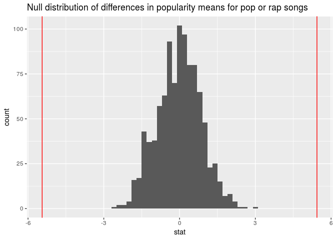<!-- -->

    ## # A tibble: 1 x 1
    ##   pvalue
    ##    <dbl>
    ## 1      0

The p-value of the difference between the popularity of Pop and Rap
songs is 0%, which is the proportion of observations that are at least
as extreme or more extreme than the observed difference in means (6.15).
Since 0% is less than a significance level of 5%, the null hypothesis is
rejected, meaning that the data provides convincing evidence that there
is a difference in mean popularities of songs that are Pop versus Rap.

#### Popularity Difference Between High Energy and Low Energy

From the visualizations, we saw that songs with more energy were more
likely to have a greater popularity. We wanted to see if the difference
in popularity between sonogs with high and low energy (defined as songs
with energy at or above .5 and energy below .5 respectively) was
significant.

Null Hypothesis: There is not a difference between the mean popularities
of songs that have high energy and low energy. Alternative Hypothesis:
There is a difference between the mean popularities of songs that have
high energy and low energy.

    ## [1] -10.35784

The observed mean popularity difference between songs with high and low
energyy is 9.688.

<!-- -->

    ## # A tibble: 1 x 1
    ##   pvalue
    ##    <dbl>
    ## 1      0

The p-value of the difference between high and low energy is 0, which
mean we can reject the null hypothesis that there is not a difference
between the mean popularities of songs that have high energy and low
energy. The data provides convincing evidence that there is a difference
in mean popularities of songs that have high energy versus low
energy.

#### Popularity Difference Between High Danceability and Low Danceabililty

From the visualizations, we saw that songs with more danceability were
more likely to have a greater popularity. We wanted to see if the
difference in popularity between sonogs with high and low danceability
(defined as songs with danceabililty at or above .5 and danceability
below .5 respectively) was significant.

Null Hypothesis: There is not a difference between the mean popularities
of songs that have high danceability and low danceability Alternative
Hypothesis: There is a difference between the mean popularities of songs
that have high danceability and low danceability

    ## [1] -9.20939

The observed mean popularity difference between songs with high and low
danceabiliity is 8.56.

<!-- -->

    ## # A tibble: 1 x 1
    ##   pvalue
    ##    <dbl>
    ## 1      0

The p-value of the difference between high and low danceability is 0,
which means we can reject the null hypothesis that there is not a
difference between the mean popularities of songs that have high
danceability and low danceability The data provides convincing evidence
that there is a difference in mean popularities of songs that have high
danceability versus low danceability

#### Popularity Difference Between High Speechiness and Low Speechiness

From the visualizations, we saw that songs with more speechiness were
more likely to have a greater popularity. We wanted to see if the
difference in popularity between sonogs with high and low speechiness
(defined as songs with speechiness at or above .5 and speechiness below
.5 respectively) was significant.

Null Hypothesis: There is not a difference between the mean popularities
of songs that have high speechiness and low speechiness Alternative
Hypothesis: There is a difference between the mean popularities of songs
that have high speechiness and low speechiness

    ## [1] 21.43577

The observed mean popularity difference between songs with high and low
speechiness is 23.09.
<!-- -->

The p-value of the difference between high and low speechiness is 0,
which means we can reject the null hypothesis that there is not a
difference between the mean popularities of songs that have high
speechiness and low speechiness The data provides convincing evidence
that there is a difference in mean popularities of songs that have high
speechiness versus low speechiness.

#### Popularity Difference Between High Valence and Low Valence

From the linear model, we saw that songs with less valence were more
likely to have a greater popularity. We wanted to see if the difference
in popularity between songs with high and low valence (defined as songs
with valence at or above .5 and valence below .5 respectively) was
significant.

Null Hypothesis: There is not a difference between the mean popularities
of songs that have high valence and low valence Alternative Hypothesis:
There is a difference between the mean popularities of songs that have
high valence and low valence

    ## [1] -2.302456

The observed difference in mean popularity between songs with high and
low valence is 2.12.

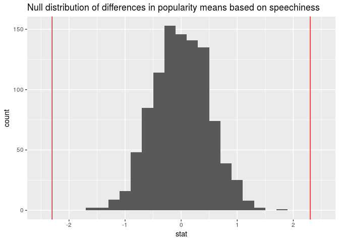<!-- -->

    ## # A tibble: 1 x 1
    ##   pvalue
    ##    <dbl>
    ## 1      0

The p-value of the difference between high and low valence is 0, which
means we can reject the null hypothesis that there is not a difference
between the mean popularities of songs that have high valence and low
valence. The data provides convincing evidence that there is a
difference in mean popularities of songs that have high valence versus
low valence.

#### Popularity Difference Between Major and Minor

We wanted to see if the difference in popularity between songs in a
major or minor mode was significant.

Null Hypothesis: There is not a difference between the mean popularities
of songs that are in a major mode versus minor mode. Alternative
Hypothesis: There is a difference between the mean popularities of songs
that are in a major mode versus minor mode.

    ## [1] 2.496376

The observed mean popularity difference between major and minor songs is
2.03. 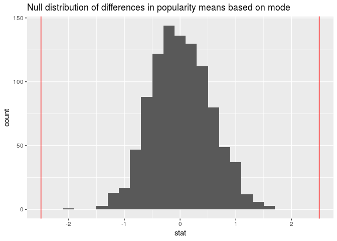<!-- -->

    ## # A tibble: 1 x 1
    ##   pvalue
    ##    <dbl>
    ## 1      0

The p-value of the difference between major and minor is 0, which means
we can reject the null hypothesis that there is not a difference between
the mean popularities of songs that are in a major or minor mode. The
data provides convincing evidence that there is a difference in mean
popularities of songs that are in a major mode versus a minor mode.

### Bootstrapping to find confidence intervals

In this section, bootstrapping was used to determine the confidence
intervals for the difference in mean popularity scores between different
categories within variables. For example, the confidence interval for
the difference in mean popularity scores between the Rap and Pop genres
(the most popular 2 genres) were
    calculated.

### Genre

    ## `stat_bin()` using `bins = 30`. Pick better value with `binwidth`.

<!-- -->

    ## # A tibble: 1 x 1
    ##   lower_bound
    ##         <dbl>
    ## 1        3.63

    ## # A tibble: 1 x 1
    ##   upper_bound
    ##         <dbl>
    ## 1        6.94

We are 95% certain that the difference in means between the popularity
score of the rap and pop genres is between 3.6322097 and 6.9427425.

### Time Signature

From the boxplot in the visualizations section, we can see that the 4/4
time signature had a higher average population score than the rest of
the time signatures. Thus, we decided to construct a confidence interval
estimating the difference in popularity means between songs with a 4/4
time signature and songs that do not use a 4/4 time signature.

    ## # A tibble: 2 x 2
    ##   time_signatureHL average
    ##   <chr>              <dbl>
    ## 1 4/4                 45.7
    ## 2 Not 4/4             33.8

We can see that songs with 4/4 time signature have an average popularity
score that is around 10 higher than songs that do not have a 4/4 time
signature.

    ## `stat_bin()` using `bins = 30`. Pick better value with `binwidth`.

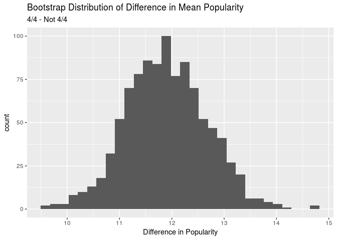<!-- -->

    ## # A tibble: 1 x 1
    ##   lower_bound
    ##         <dbl>
    ## 1        10.3

    ## # A tibble: 1 x 1
    ##   upper_bound
    ##         <dbl>
    ## 1        13.3

We are 95% certain that the difference in popularity means between the
songs with higher (highest 25%) time\_signature and the lower (lowest
25%) time\_signature is between 10.3330298 and 13.2914775.

### Confidence intervals for continous variables

The following variables were selected because the visualizations showed
that they had the strongest linear relationships with popularity scores.
The variables that were chosen are: danceability, energy, liveness,
loudness, and acousticness.

For each of these variables, we took the highest 25% of the data (“High”
danceability, energy, liveness etc.) and the lowest 25% of the data
(“Low” danceability, energy, liveness etc.) and conducted a 95%
confidence interval test for the difference in mean popularities between
the two.

### Danceability

    ## # A tibble: 1 x 4
    ##     max    min    q1    q3
    ##   <dbl>  <dbl> <dbl> <dbl>
    ## 1 0.969 0.0599 0.434 0.688

    ## # A tibble: 2 x 2
    ##   danceHL average
    ##   <chr>     <dbl>
    ## 1 High       46.8
    ## 2 Low        35.7

Songs with high danceability have a mean popularity score that is around
10 higher compared songs with low
    danceability.

    ## `stat_bin()` using `bins = 30`. Pick better value with `binwidth`.

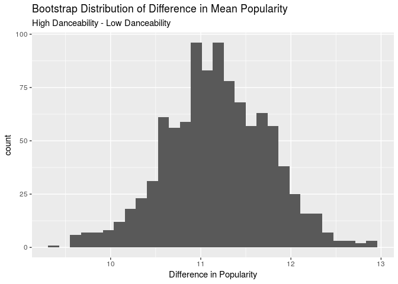<!-- -->

    ## # A tibble: 1 x 1
    ##   lower_bound
    ##         <dbl>
    ## 1        10.1

    ## # A tibble: 1 x 1
    ##   upper_bound
    ##         <dbl>
    ## 1        12.2

We are 95% certain that the difference in popularity means between the
songs with high danceability and low danceability is between 10.1157459
and 12.2335473.

### Energy

    ## # A tibble: 1 x 4
    ##     max     min    q1    q3
    ##   <dbl>   <dbl> <dbl> <dbl>
    ## 1 0.996 0.00152 0.399 0.791

    ## # A tibble: 2 x 2
    ##   energyHL average
    ##   <chr>      <dbl>
    ## 1 High        46.7
    ## 2 Low         34.1

Songs with high energy have a mean popularity score that is around 10
higher compared songs with low
    energy.

    ## `stat_bin()` using `bins = 30`. Pick better value with `binwidth`.

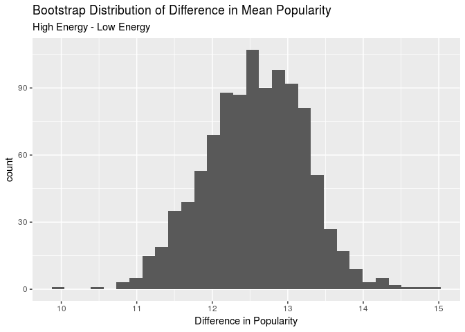<!-- -->

    ## # A tibble: 1 x 1
    ##   lower_bound
    ##         <dbl>
    ## 1        11.2

    ## # A tibble: 1 x 1
    ##   upper_bound
    ##         <dbl>
    ## 1        13.9

We are 95% certain that the difference in means between songs with high
energy and low energy is between 11.1802659 and 13.880382.

### Liveness

    ## # A tibble: 1 x 4
    ##     max    min     q1    q3
    ##   <dbl>  <dbl>  <dbl> <dbl>
    ## 1 0.985 0.0244 0.0975 0.263

    ## # A tibble: 2 x 2
    ##   livenessHL average
    ##   <chr>        <dbl>
    ## 1 High          39.4
    ## 2 Low           45.4

Songs with high liveness (chances of having been performed live) have a
mean popularity score that is around 6 lower compared songs with low
liveness.

    ## `stat_bin()` using `bins = 30`. Pick better value with `binwidth`.

<!-- -->

    ## # A tibble: 1 x 1
    ##   lower_bound
    ##         <dbl>
    ## 1       -7.41

    ## # A tibble: 1 x 1
    ##   upper_bound
    ##         <dbl>
    ## 1       -4.60

We are 95% certain that the difference in popularity means between songs
with high liveness and low liveness is between-7.4113724 and -4.5951704.

### Loudness

    ## # A tibble: 1 x 4
    ##     max   min    q1    q3
    ##   <dbl> <dbl> <dbl> <dbl>
    ## 1 0.496 -42.1 -11.5 -5.45

    ## # A tibble: 2 x 2
    ##   loudnessHL average
    ##   <chr>        <dbl>
    ## 1 High          50.9
    ## 2 Low           31.2

Songs with high loudness have a mean popularity score that is around 18
higher compared with songs with low
    loudness.

    ## `stat_bin()` using `bins = 30`. Pick better value with `binwidth`.

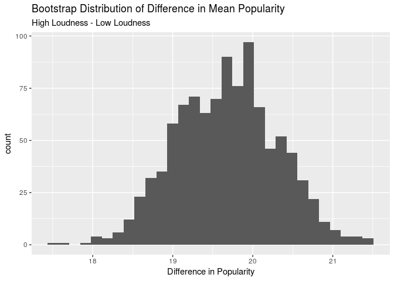<!-- -->

    ## # A tibble: 1 x 1
    ##   lower_bound
    ##         <dbl>
    ## 1        18.4

    ## # A tibble: 1 x 1
    ##   upper_bound
    ##         <dbl>
    ## 1        21.0

We are 95% certain that the difference in mean popularity scores between
songs with high loudness and the low loudness is between 18.4429662 and
20.9865323.

### Acousticness

    ## # A tibble: 1 x 4
    ##     max        min     q1    q3
    ##   <dbl>      <dbl>  <dbl> <dbl>
    ## 1 0.996 0.00000266 0.0307 0.707

    ## # A tibble: 2 x 2
    ##   acousticnessHL average
    ##   <chr>            <dbl>
    ## 1 High              30.4
    ## 2 Low               50.0

Songs with high acousticness have a mean popularity score that is around
18 lower compared songs with low
    acousticness.

    ## `stat_bin()` using `bins = 30`. Pick better value with `binwidth`.

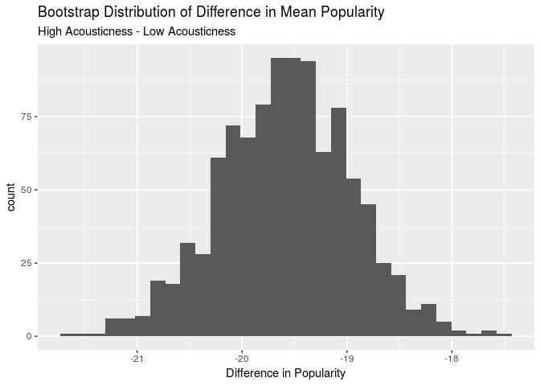<!-- -->

    ## # A tibble: 1 x 1
    ##   lower_bound
    ##         <dbl>
    ## 1       -20.8

    ## # A tibble: 1 x 1
    ##   upper_bound
    ##         <dbl>
    ## 1       -18.4

We are 95% certain that the difference in popularity means between songs
with high acousticness and the low acousticness is between -20.8498802
and -18.3795747.

### Valence

    ## # A tibble: 1 x 4
    ##     max   min    q1    q3
    ##   <dbl> <dbl> <dbl> <dbl>
    ## 1 0.985     0 0.226 0.639

    ## # A tibble: 2 x 2
    ##   valenceHL average
    ##   <chr>       <dbl>
    ## 1 High         44.6
    ## 2 Low          38.6

Songs with high valence have a mean popularity score that is around 5
higher compared songs with low
    valence.

    ## `stat_bin()` using `bins = 30`. Pick better value with `binwidth`.

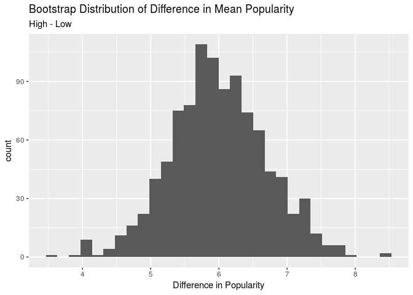<!-- -->

    ## # A tibble: 1 x 1
    ##   lower_bound
    ##         <dbl>
    ## 1        4.59

    ## # A tibble: 1 x 1
    ##   upper_bound
    ##         <dbl>
    ## 1        7.37

We are 95% certain that the difference in means between songs with high
valence and low valence is between 4.5890988 and 7.3676782.

### Conclusion

Your project goes here\! Before you submit, make sure your chunks are
turned off with `echo = FALSE`.

You can add sections as you see fit. Make sure you have a section called
Introduction at the beginning and a section called Conclusion at the
end. The rest is up to you\!
