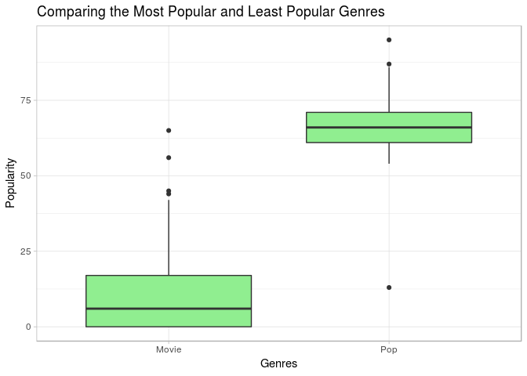
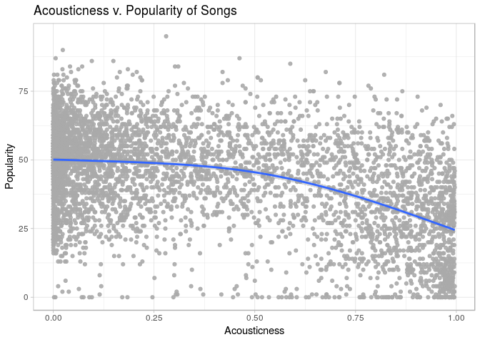
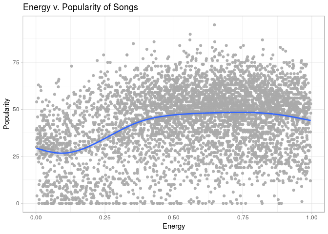
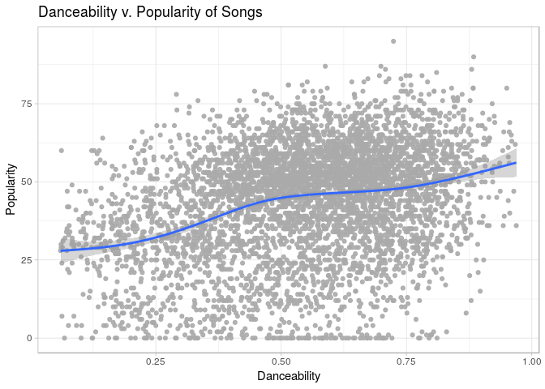
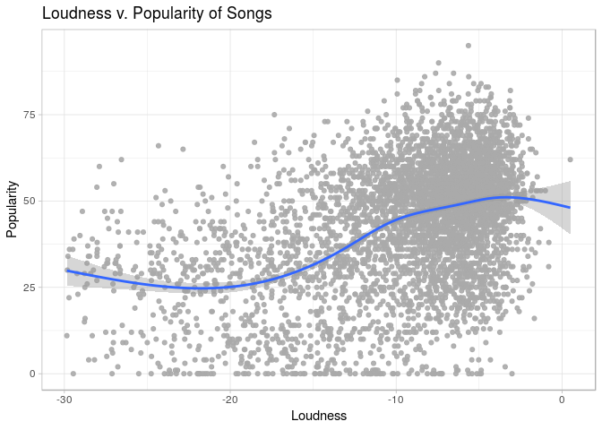
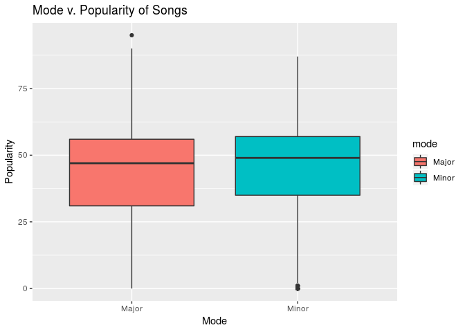
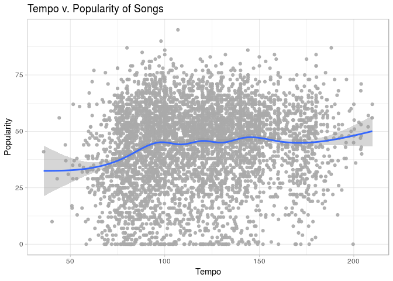

Project Proposal: What Makes a Song Popular on Spotify?
================
CCBK
3/21/18

    ## Parsed with column specification:
    ## cols(
    ##   genre = col_character(),
    ##   artist_name = col_character(),
    ##   track_name = col_character(),
    ##   track_id = col_character(),
    ##   popularity = col_double(),
    ##   acousticness = col_double(),
    ##   danceability = col_double(),
    ##   duration_ms = col_double(),
    ##   energy = col_double(),
    ##   instrumentalness = col_double(),
    ##   key = col_character(),
    ##   liveness = col_double(),
    ##   loudness = col_double(),
    ##   mode = col_character(),
    ##   speechiness = col_double(),
    ##   tempo = col_double(),
    ##   time_signature = col_character(),
    ##   valence = col_double()
    ## )

### Introduction

The goal of our project is to determine the qualities of a song that
influence popularity on Spotify. The dataset was retrieved online from
kaggle.com. The data is derived from the Spotify Web API, which uses
internal Spotify metrics to determine the parameters of the dataset. For
subjective variables such as danceability and instrumentalness, the
Spotify Web API utilizes Echo Nest algorithms. The dataset curator
retrieved data for 228159 songs at random and aggregated this
information into the dataset. Because the data set was so large and
difficult to analyze in R-studio, a random sample of 5000 data points
was taken and a new csv file was made.

This project will analyze the variables of a song that correlate with a
higher song popularity. To find this, we will assign song popularity as
our dependent response variable and the other variables such as
danceability, energy, and key as our predictor variables. Using
backwards selection using multiple predictors models, we can determine
which variables are the best predictors of a song’s popularity score.
Higher R^2 value for single predictors model or a higher adjusted R^2
value for multiple predictors can help us determine this. Visualizations
will be used to show general trends in popularity through various the
qualitative and quantitative variables. Bootstraps and permutations will
look at whether significant differences exist between certain variables
as well as confidence intervals. These different statistical strategies
all contribute to the research question of what qualities of a song
contribute to its popularity.

### Visualization

Relationship Between Different Variables and Song Popularity

    ## # A tibble: 26 x 2
    ##    genre            medianpop
    ##    <chr>                <dbl>
    ##  1 Pop                     66
    ##  2 Rap                     60
    ##  3 Rock                    58
    ##  4 Dance                   57
    ##  5 Hip-Hop                 57
    ##  6 Alternative             54
    ##  7 Anime                   54
    ##  8 Blues                   54
    ##  9 Children’s Music        54
    ## 10 Indie                   54
    ## # … with 16 more rows

<!-- -->

    ## `geom_smooth()` using method = 'gam' and formula 'y ~ s(x, bs = "cs")'

<!-- -->

    ## `geom_smooth()` using method = 'gam' and formula 'y ~ s(x, bs = "cs")'

<!-- -->

    ## `geom_smooth()` using method = 'gam' and formula 'y ~ s(x, bs = "cs")'

<!-- -->

    ## `geom_smooth()` using method = 'gam' and formula 'y ~ s(x, bs = "cs")'

<!-- -->

    ## `geom_smooth()` using method = 'gam' and formula 'y ~ s(x, bs = "cs")'

<!-- -->

<!-- -->

    ## `geom_smooth()` using method = 'gam' and formula 'y ~ s(x, bs = "cs")'

<!-- -->

    ## `geom_smooth()` using method = 'gam' and formula 'y ~ s(x, bs = "cs")'

<!-- -->

<!-- -->

    ## `geom_smooth()` using method = 'gam' and formula 'y ~ s(x, bs = "cs")'

<!-- -->

    ## `geom_smooth()` using method = 'gam' and formula 'y ~ s(x, bs = "cs")'

<!-- -->

<!-- -->

    ## `geom_smooth()` using method = 'gam' and formula 'y ~ s(x, bs = "cs")'

<!-- -->

### Data Wrangling

### Linear Regression

    ## 
    ## Call:
    ## lm(formula = popularity ~ acousticness + danceability + energy + 
    ##     instrumentalness + liveness + loudness + speechiness + tempo + 
    ##     valence + loudness * liveness, data = songs)
    ## 
    ## Coefficients:
    ##       (Intercept)       acousticness       danceability  
    ##          55.92945          -13.84582           16.60983  
    ##            energy   instrumentalness           liveness  
    ##          -6.46620           -3.73733           -4.99717  
    ##          loudness        speechiness              tempo  
    ##           0.62554           -6.76749            0.01213  
    ##           valence  liveness:loudness  
    ##          -9.21265            0.73623

    ## [1] 0.3035142

    ## [1] 0.3021182

    ## Start:  AIC=26948.77
    ## popularity ~ acousticness + danceability + energy + instrumentalness + 
    ##     liveness + loudness + speechiness + tempo + valence + loudness * 
    ##     liveness
    ## 
    ##                     Df Sum of Sq     RSS   AIC
    ## <none>                           1090937 26949
    ## - tempo              1       640 1091576 26950
    ## - energy             1      2820 1093757 26960
    ## - liveness:loudness  1      2839 1093776 26960
    ## - instrumentalness   1      3783 1094719 26964
    ## - speechiness        1      4854 1095791 26969
    ## - valence            1     16658 1107595 27022
    ## - danceability       1     25353 1116290 27062
    ## - acousticness       1     43888 1134825 27144

    ## 
    ## Call:
    ## lm(formula = popularity ~ acousticness + danceability + energy + 
    ##     instrumentalness + liveness + loudness + speechiness + tempo + 
    ##     valence + loudness * liveness, data = songs)
    ## 
    ## Coefficients:
    ##       (Intercept)       acousticness       danceability  
    ##          55.92945          -13.84582           16.60983  
    ##            energy   instrumentalness           liveness  
    ##          -6.46620           -3.73733           -4.99717  
    ##          loudness        speechiness              tempo  
    ##           0.62554           -6.76749            0.01213  
    ##           valence  liveness:loudness  
    ##          -9.21265            0.73623

    ## [1] 0.3035142

    ## [1] 0.3021182

score\_hat = 56.20 + -11.30 \* acousticness + 17.19 \* danceability -
5.933 \* energy - 4.11 \* instrumentalness + -6.40 \* liveness + 0.60 \*
loudness + -10.36 \* speechiness + -8.25 \* valence + 0.62 \*
liveness:loudness

When all variables have a value of 0, then it is expected that a song’s
populariy is 56.20 One example of how a variable influences the
popularity is with acousticness. If a song’s acoustic score increases by
1 then popularity will on average decrease by 11.30 points, all else
held constant. There is also an apparent interaction between
danceability and energy. When the interaction increases by one on
average the popularity decreases by 12.96 points, all else held
constant.

The adjusted R squared value for this model is 0.289, which means that
roughly 28.9% of the variability in a song’s popularity can be explained
by the different variables in the multiple regression model. This
indicates that there is a weak to moderate positive overall realtionship
between a song’s popularity and the different variables related to a
song.

    ## 
    ## Call:
    ## lm(formula = popularity ~ mode, data = songs)
    ## 
    ## Coefficients:
    ## (Intercept)    modeMinor  
    ##      43.100        2.496

    ## [1] 0.004568754

score\_hat = 43.77 + 2.007 \* mode\_minor

Minor equation: score\_hat = 43.77 + 2.007 \* 1 = 45.77

Major equestion: score\_hat = 43.77 + 2.007 \* 0 = 43.77

Songs that are in the major mode tent to have higher popularity scores
than songs in a minor key. All else held constant, theere is an expected
popularity score increase of 2.007 if the song is in the minor key
compared to the major key.

    ## 
    ## Call:
    ## lm(formula = popularity ~ genre, data = songs)
    ## 
    ## Coefficients:
    ##           (Intercept)       genreAlternative             genreAnime  
    ##                 8.750                 45.490                 45.278  
    ##            genreBlues  genreChildren’s Music         genreClassical  
    ##                46.417                 46.466                 22.621  
    ##           genreComedy           genreCountry             genreDance  
    ##                12.159                 38.587                 48.756  
    ##       genreElectronic              genreFolk           genreHip-Hop  
    ##                29.356                 40.616                 49.903  
    ##            genreIndie              genreJazz             genreMovie  
    ##                46.193                 31.223                  1.538  
    ##            genreOpera               genrePop               genreR&B  
    ##                 3.711                 57.695                 43.260  
    ##              genreRap            genreReggae         genreReggaeton  
    ##                52.255                 27.397                 28.750  
    ##             genreRock               genreSka              genreSoul  
    ##                50.429                 19.490                 38.485  
    ##       genreSoundtrack             genreWorld  
    ##                24.534                 27.082

    ## [1] 0.7098728

### Bootstrapping

### Conclusion

Your project goes here\! Before you submit, make sure your chunks are
turned off with `echo = FALSE`.

You can add sections as you see fit. Make sure you have a section called
Introduction at the beginning and a section called Conclusion at the
end. The rest is up to you\!
