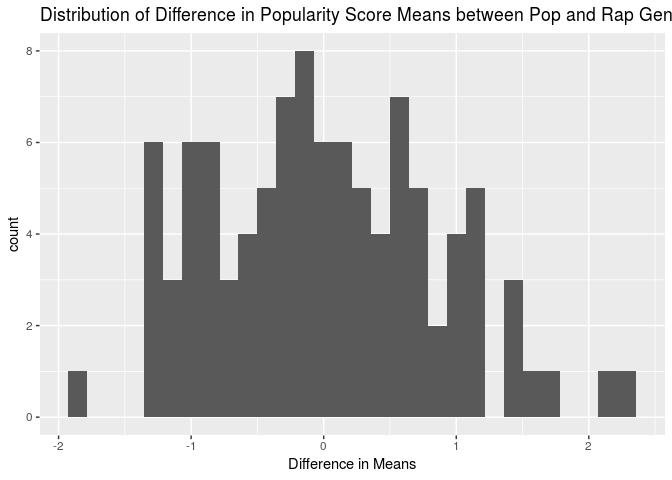
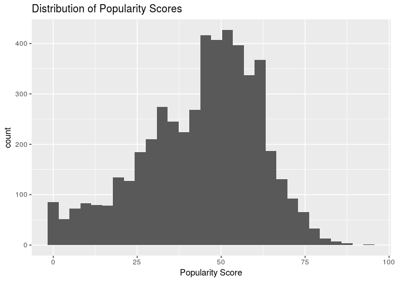

Project Proposal: What Makes a Song Popular on Spotify?
================
CCBK
3/21/19

    ## Parsed with column specification:
    ## cols(
    ##   genre = col_character(),
    ##   artist_name = col_character(),
    ##   track_name = col_character(),
    ##   track_id = col_character(),
    ##   popularity = col_double(),
    ##   acousticness = col_double(),
    ##   danceability = col_double(),
    ##   duration_ms = col_double(),
    ##   energy = col_double(),
    ##   instrumentalness = col_double(),
    ##   key = col_character(),
    ##   liveness = col_double(),
    ##   loudness = col_double(),
    ##   mode = col_character(),
    ##   speechiness = col_double(),
    ##   tempo = col_double(),
    ##   time_signature = col_character(),
    ##   valence = col_double()
    ## )

    ## # A tibble: 5,000 x 18
    ##    genre artist_name track_name track_id popularity acousticness
    ##    <chr> <chr>       <chr>      <chr>         <dbl>        <dbl>
    ##  1 Dance Lostboycrow Verona     2DRfWdO…         50      0.196  
    ##  2 Dance JP Cooper   Wait       3hqJFkx…         68      0.192  
    ##  3 Ska   The Aquaba… Dear Spike 25TYdzF…         22      0.0888 
    ##  4 R&B   Sampha      What Shou… 7gDc8hQ…         48      0.922  
    ##  5 Movie Riders In … Cowpoke    5JMJdZg…          2      0.876  
    ##  6 Rock  The Growle… Big Toe    7qHBtTd…         49      0.0102 
    ##  7 Dance Lizzo       Jang a La… 3s3tKXk…         42      0.00365
    ##  8 Opera Léo Delibes Sylvia ou… 2KpiSeb…         10      0.942  
    ##  9 Clas… Michael Ha… Concertin… 1wnnXK7…         30      0.974  
    ## 10 Dance Calvin Har… Promises … 3Lv3frZ…         68      0.186  
    ## # … with 4,990 more rows, and 12 more variables: danceability <dbl>,
    ## #   duration_ms <dbl>, energy <dbl>, instrumentalness <dbl>, key <chr>,
    ## #   liveness <dbl>, loudness <dbl>, mode <chr>, speechiness <dbl>,
    ## #   tempo <dbl>, time_signature <chr>, valence <dbl>

## Section 1. Introduction

The goal of our project is to determine the qualities of a song that
influence popularity on Spotify. The dataset was retrieved online at
<https://www.kaggle.com/edalrami/19000-spotify-songs>. The data is
derived from the Spotify Web API, which uses internal Spotify metrics to
determine the parameters of the dataset. For subjective variables such
as danceability and instrumentalness, the Spotify Web API utilizes Echo
Nest algorithms. The dataset curator retrieved data for 19,000 songs at
random and aggregated this information into the dataset. Below is a
brief description explaining the 18 variables that are within the chosen
dataset.

  - Categorical Variables: Genre, artist\_name, track\_name, track\_id,
    mode, time\_signature (An estimated overall time signature of a
    track), key.

  - Continuous Numerical Variables: duration\_ms (Duration of song in
    miliseconds), loudness (The overall loudness of the track in
    decibels), tempo (The overall estimate beats per minute of the
    track).

  - Discrete Numerical Variables: popularity (The popularity of the
    track from 0 to 100 based on recent stream counts), acousticness (A
    confidence measure from 0 to 1.0 of whether the song is acoustic),
    danceability (How suitable a song is for dancing from 0 to 1.0),
    liveness (The likelihood that the track was performed live from 0 to
    1.0), valence (A measure from 0.0 to 1.0 describing the musical
    positiveness), instrumentalness (A confidence measure from 0 to 1.0
    on whether song is instrumental), energy (A song’s energy from 0.0
    to 1.0 considering various factors), speechiness (A measure of how
    exclusively speech-like the track is from 0 to 1.0).

## Section 2. Data analysis plan

This project will analyze the variables of a song that correlate with a
higher song popularity. To find this, we will assign song popularity as
our dependent response variable and the other variables such as
danceability, energy, and key as our predictor variables. Using single
predictors models and backwards selection using multiple predictors
models, we can determine which variables are the best predictors of a
song’s popularity score. Higher R^2 value for single predictors model or
a higher adjusted R^2 value for multiple predictors can help us
determine this.

R^2 value for liveness as a predictor of popularity:

    ## [1] 0.03832614

R^2 value for energy as a predictor of popularity:

    ## [1] 0.08138488

From the r-squared values, we can see that energy is a better predictor
of popularity compared with liveness. However, variation in energy only
accounts for 7.7% of the variability in song popularity score.

In addition to looking at individual songs, we intend to group songs by
genres or playlists. After grouping, we will explore the difference in
popularity means/medians within certain genres. For example, if the
genres rap and pop each have 100 songs within the data set, we will
perform simulations on samples with replacement from both genres to
create a distribution of the difference in means. In this case,
popularity score would be the response variable and the genre would be
the explanatory variable. Then we will look at the p-value (p-value \<
0.05 for proving dependence) to determine if there is a significant
difference. 95% confidence intervals for the difference in popularity
score means or medians can also be used to make conclusions about this
kind of data.

Average population scores by genre:

    ## # A tibble: 26 x 2
    ##    genre            average
    ##    <chr>              <dbl>
    ##  1 Pop                 67.1
    ##  2 Rap                 60.9
    ##  3 Rock                58.9
    ##  4 Hip-Hop             58.3
    ##  5 Dance               55.7
    ##  6 Anime               55.2
    ##  7 Alternative         54.5
    ##  8 Children’s Music    54.5
    ##  9 Blues               54.4
    ## 10 Indie               54.3
    ## # … with 16 more rows

Pop and Rap genres have the highest average population scores. The
difference in the sample popularity means of Pop and Rap genres is 6.06.

  - Null Hypothesis: Pop and Rap genres have the same average song
    popularity scores.
  - Alternate Hypothesis: Pop and Rap genres have different average song
    popularity
    scores.

<!-- end list -->

    ## `stat_bin()` using `bins = 30`. Pick better value with `binwidth`.

<!-- -->

    ## # A tibble: 1 x 1
    ##   p_value
    ##     <dbl>
    ## 1       0

A p-value of 0 \< 0.05 indicates that we can reject the null hypothesis
in favor of the alternate hypothesis, and that the observed difference
was not due to chance. Results such as this can help us recognize
statistically significant differences between popularity scores between
different populations, and ultimately help us determine what constitutes
a popular song.

Visualizations can be used to determine skewness of the data set. This
will help us determine whether mean/SD or median/IQR is more fitting to
describe the certain variables or groupings. We will be interested in
looking at the distribution of different variables. A skew will indicate
that the songs tend towards a certain type of sound. The goal is to have
a representative sample of the entirety of spotify, with a range of
different popularities, keys, liveliness, and
    more.

    ## `stat_bin()` using `bins = 30`. Pick better value with `binwidth`.

<!-- -->

The distribution of popularity scores is skewed slightly left skewed.
Because there is a skew in the data, the median is likely a better
indicator of the center.

## Section 3. Data

    ## Observations: 5,000
    ## Variables: 18
    ## $ genre            <chr> "Dance", "Dance", "Ska", "R&B", "Movie", "Rock"…
    ## $ artist_name      <chr> "Lostboycrow", "JP Cooper", "The Aquabats!", "S…
    ## $ track_name       <chr> "Verona", "Wait", "Dear Spike", "What Shouldn't…
    ## $ track_id         <chr> "2DRfWdOZhBi00BcCwv9ljR", "3hqJFkxeobh6Y9mOL37N…
    ## $ popularity       <dbl> 50, 68, 22, 48, 2, 49, 42, 10, 30, 68, 46, 51, …
    ## $ acousticness     <dbl> 0.196000, 0.192000, 0.088800, 0.922000, 0.87600…
    ## $ danceability     <dbl> 0.704, 0.552, 0.579, 0.348, 0.615, 0.510, 0.854…
    ## $ duration_ms      <dbl> 190704, 231533, 244440, 212585, 102040, 151719,…
    ## $ energy           <dbl> 0.7320, 0.5800, 0.9800, 0.1530, 0.1680, 0.7660,…
    ## $ instrumentalness <dbl> 7.73e-05, 0.00e+00, 0.00e+00, 6.27e-02, 1.25e-0…
    ## $ key              <chr> "F", "E", "B", "G", "C", "E", "A#", "G#", "D", …
    ## $ liveness         <dbl> 0.0951, 0.1130, 0.1430, 0.0996, 0.0982, 0.0673,…
    ## $ loudness         <dbl> -6.125, -8.062, -2.907, -16.777, -15.317, -5.81…
    ## $ mode             <chr> "Minor", "Major", "Major", "Minor", "Major", "M…
    ## $ speechiness      <dbl> 0.0539, 0.0466, 0.1620, 0.0290, 0.0306, 0.0278,…
    ## $ tempo            <dbl> 105.044, 79.895, 129.977, 86.020, 93.243, 132.1…
    ## $ time_signature   <chr> "4/4", "4/4", "4/4", "4/4", "1/4", "4/4", "4/4"…
    ## $ valence          <dbl> 0.6990, 0.2900, 0.6840, 0.4030, 0.4470, 0.7270,…
